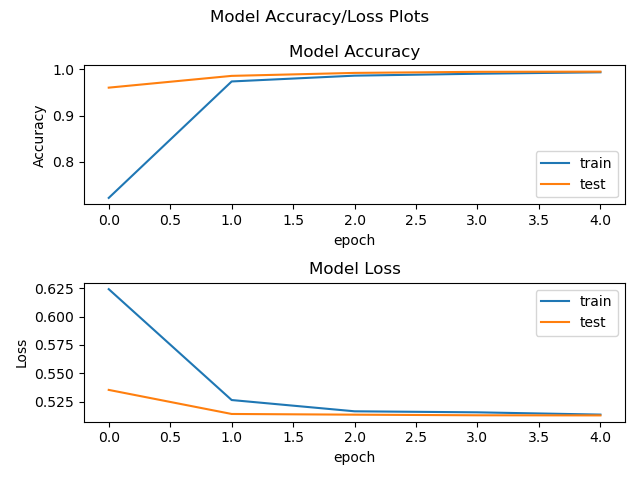
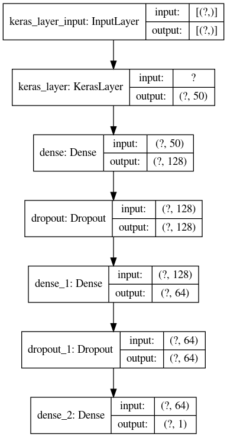
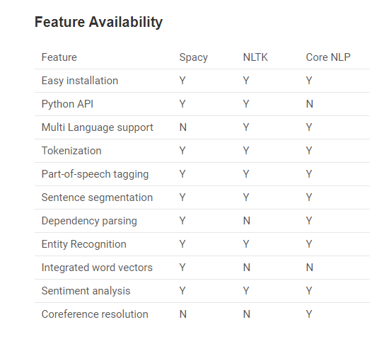
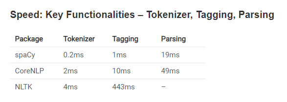
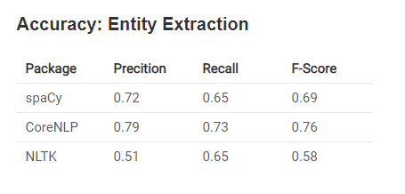

## Setup
```bash
# Creating Conda environment
conda env create -f env.yml
# Activating the environment
conda activate BioPageClassifier

# Downloading NLTK Corpora
python -m nltk.downloader all
# Downloading spaCY model
python -m spacy download en_core_web_sm
# Downloading Word Embeddings Glove.6B
[ ! -d "glove.6B" ] && \
  wget http://nlp.stanford.edu/data/glove.6B.zip && \
  mkdir -p .glove.6B && \
  unzip glove.6B.zip -d .glove.6B && \
  rm glove.6B.zip
```

## Crawler
You can run crawler to collect negative data by running the following:
```bash
# Running Spider

$ scrapy runspider crawler.py \
  -a start_url=https://www.cnn.com/ \
  -a allowed_domain=cnn.com \
  -a db=/tmp/cnn_db.json \
  -a output=/tmp \
  -a exclude='.+?(show|business).+?'
```

## Classifier
Classifier model is saved in `bio-model`
### Accuracy / Loss Chart

### Model Architecture Chart


## Usage
Get the model
```bash
wget https://drive.google.com/file/d/1NShUBtE248LN_L1zzyGbK__4I60bkk0R/view?usp=sharing
[ ! -d "bio-model" ] && unzip bio-model.zip 
```

Load the model
```python
from utils import *

bio_identifier = BioIdentifier(model="bio-model")
# Returns False
bio_identifier.is_bio_url("https://www.cnn.com/")
# Returns True
bio_identifier.is_bio_url("https://sites.google.com/a/oakland.edu/scottcrabill/Home")
...
bio_identifier.is_bio_html_content("<html>....</html>")
```

And just to play around in python console
```python
from utils import *
processor = TextProcessor()
def get_url_text(url):
    with urllib.request.urlopen(url) as response:
        html = response.read()
    text = BeautifulSoup(html, 'html.parser').get_text(separator=" ")
    return processor.process_text(text)

model = tf.keras.models.load_model("bio-model", custom_objects={'KerasLayer': hub.KerasLayer})


def get_scores(urls):
	for u in urls:
		txt = get_url_text(u)
		print("{} - {}".format(model.predict([txt])[0][0], txt[:50]))


urls = [
    "https://cnn.com"
]

get_scores(urls)
```


## Topic Modelling

Spacy is written in cython language, (C extension of Python designed to give C like performance to the python program). Hence is a quite fast library. spaCy provides a concise API to access its methods and properties governed by trained machine (and deep) learning models.We have used spaCy library to do topic modeling on bio pages and include it in the compiled BIO's.

## Setup

Spacy, its data, and its models can be easily installed using python package index and setup tools. Use the following command to install spacy in your machine:
```bash
#Use the following command to install spacy in your machine
sudo pip install spacy

#To download all the data and models, run the following command, after the installation:
python -m spacy.en.download all

#To load nlp for english. Use the below commands
nlp = spacy.load("en_core_web_sm")
```

## Comparison with other libraries

Spacy is very powerful and industrial strength package for almost all natural language processing tasks.
comparison of Spacy with other famous tools to implement nlp in python – CoreNLP and NLTK.








## Part of Speech Tagging

Part-of-speech tags are the properties of the word that are defined by the usage of the word in the grammatically correct sentence. We have used part of speech tagging SPacy property in our code . We also added few text cleaning function to remove unwanted information.


```bash
def isNoise(token):
    is_noise = False
    if token.pos_ in noisy_pos_tags:
        is_noise = True
    elif token.is_stop == True:
        is_noise = True
    elif len(token.string) <= min_token_length:
        is_noise = True
    elif token.string.lower().strip() in stop_words:
        is_noise = True
    elif token.string.strip() in ents:
        is_noise = True
    return is_noise
    

def cleanup(token, lower = True):
    if lower:
        token = token.lower()
    return token.strip()
```

Once the Tokenazation and text cleaning are done. we print top five key words modelled out of SPacy in the compiled BIO pages

```bash
    from collections import Counter	
    cleaned_list = [cleanup(word.string) for word in document if not isNoise(word)]
    counts=Counter(cleaned_list).most_common(5)   
```

## Ouput

Output get stored in all the compiled BIO files in below format.

```bash
Key Words based on Topic Modelling done through SPACY:
research	compiler	software	students	projects
```


